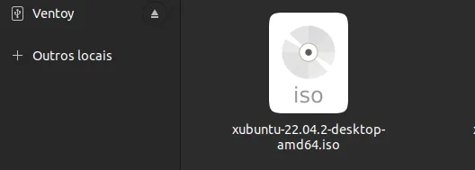

## Formatação e instalação xubunto em notebook positivo motion Q232B com pendrive bootavel ventoy

### Detalhes:<br>
- Pendrive sandisk 8GB
- Programa para boot VENTOY
- Notebook utilizado para criar o pendrive bootavel e baixar ISO : Dell Inspiron 5458/ 64 bits /4GB memoria/ 1TB armazenamento/Ubunto 22.04LTS
- Notebook formatado: positivo motion Q232B /64 bits / 2GB memoria / 32 GB armazenamento / intel quad-core.

### Para criar um pendrive bootavel:
```
Observação: Tenha um pendrive de 4GB pelo menos, vamos formata-lo, faça backup se tiver documentos que queira salvar, pois essa operação apagará completamente os dados.
```
<strong>Passo 1.</strong> Insira o pendrive no seu pc: botão direito do mouse → formatar → nome do volume → selecione o apagar → próximo → formatar → aguarde finalizar.

<br>
<br>

### Agora vamos baixar o programa ventoy e instala-lo via terminal:
<strong>Passo 2.</strong> Abra um terminal → Ctrl + Alt +T<br>

```
Observação: Os próximos passos serão feitos pelo terminal, então os comandos abaixo você copiará e colará em seu terminal e pressionará a tecla enter para executá-los.
```
<strong>Passo 3.</strong> Para sistema de 64bits:

```
wget https://github.com/ventoy/Ventoy/releases/download/v1.0.89/ventoy-1.0.89-linux.tar.gz -O ventoy.tar.gz
```
<strong>Passo 4.</strong> descompactar o arquivo baixado:

```
sudo tar -xf ventoy.tar.gz -C /opt/
```
<strong>Passo 5.</strong> Renomeie a pasta criada:

```
sudo mv /opt/ventoy*/ /opt/ventoy
```
```
Observação: Se ao executar o comando acima ocorrer um erro com a mensagem iniciando com “mv: é impossível sobrescrever o não-diretório”, pule para o próximo passo.
```
<strong>Passo 6.</strong> Crie um atalho para facilitar a execução do programa:

```
sudo ln -sf /opt/ventoy/VentoyGUI.x86_64 /usr/bin/ventoy
```

<strong>Passo 7.</strong> Se seu ambiente gráfico atual suportar, crie um lançador para o programa, executando o comando abaixo:

```
echo -e '[Desktop Entry]\n Version=1.0\n Name=Ventoy\n Path=/opt/ventoy\n Exec=/opt/ventoy/VentoyGUI.x86_64\n Icon=/opt/ventoy/WebUI/favicon.ico\n Type=Application\n Categories=Application' | sudo tee /usr/share/applications/ventoy.desktop
```

### Pronto!

Se a sua distribuição suportar, coloque o atalho na sua área de trabalho usando o gerenciador de arquivos do sistema ou o comando abaixo, e use-o para iniciar o programa.

```
sudo chmod +x /usr/share/applications/ventoy.desktop
```
```
cp /usr/share/applications/ventoy.desktop  ~/Área\ de\ Trabalho/
```
Ou pelo terminal, digite o comando abaixo, seguido da tecla TAB:
```
/opt/ventoy/VentoyGUI.x86_64
```

### Baixar Xubunto:
<strong>Passo 8.</strong> Acesse o site abaixo e procure pela versão LTS recente, baixe a extensão .iso.<br>
<strong>Exemplo:</strong> xubuntu-22.04.2-desktop-amd64.iso

```
https://cdimage.ubuntu.com/xubuntu/releases/jammy/release/
```

### Configurar o ventoy para receber a .ISO:
```
Observação: O pendrive formatado precisa estar plugado no notebook para os pŕoximos passos.
```
<strong>Passo 9.</strong> Execute o programa ventoy

<strong>Passo 10.</strong> Em Device → adicione seu pendrive que foi formatado → Install → mostrará uma mensagem que o disco será formatado e todos os dados serão perdidos → ok → ok

<br>

Após instalar ele particionará uma partição para o próprio ventoy e outra para sua imagem ISO.<br>

<br>

Em seu computador em → discos → poderá ver as duas partições criadas:

<br>

<strong>Passo 11.</strong> Arraste sua imagem .ISO que foi baixada do site para dentro do pendrive:
<br>

<br>

```
Observação: Aguarde ele copiar os arquivos. Quando terminar verá que o arquivo esta dentro do pendrive ventoy, retire ele desse computador desconectando ele da forma segura → botão direito em cima do pendrive → ejetar.
```

### Formatação no notebook positivo motion Q232B:

<strong>Passo 12.</strong> Vamos conectar o pendrive nesse notebook

<strong>Passo 13.</strong> Ligue o notebook e no teclado clique constantemente em <strong>DEL</strong>

<strong>Passo 14.</strong> Entrará na BIOS do notebook.

<strong>Passo 15.</strong> Usando as setas do teclado vá até <strong>Boot</strong>

<strong>Passo 16.</strong> Em Boot Option Priorities → Deixe o pedrive como <strong> #1 opção </strong>, utilize as setas do teclado para mover e enter para escolher.

<br>

<strong>Passo 17.</strong> Salve as configurações: <strong>Save & Exit</strong> → F4 → yes → enter

<br>

Ele reiniciará o notebook, entrando na tela do VENTOY:

<br>

<strong>Passo 18.</strong> Selecione a <strong>.iso</strong> → enter

<strong>Passo 19.</strong> Boot in normal mode → enter (caso de erro:  inicializar no modo grub2 em vez do modo normal.)

<strong>Passo 19.</strong> try or install xubunto → enter

<strong>Passo 20.</strong> Install xubunto

Ele vai solicitar algumas configurações:<br>

<strong>Passo21.</strong> choose your keyboard layout → Português(Brazil)

<strong>Passo22.</strong> Wireless → Você pode conectar sua rede wifi ou conectar depois da instalação.

<strong>Passo23.</strong> Updates and other software → Normal installation

<strong>Passo24.</strong> Installation type → erase disk and install xubunto

<strong>Passo25.</strong> Install now

<strong>Passo26.</strong> continue

<strong>Passo27.</strong> Where are you → São Paulo Time

<strong>Passo28.</strong> Who are you → aqui você preencherá como quiser, veja um exemplo:

<br>

<strong>Passo29.</strong> Agora aguarde finalizar a instalação:

<br>

#### Após finalizar a instalação, ele entrará no tela inicial do xubunto:

<br>


```
Observações:

1. Caso não entre na tela do xubunto e fique em tela preta travada, force o desligamento, espere uns minutos e ligue novamente o notebook.

2. Teclado desconfigurado: Acesse → settings → keyword → Add →
Adicione: portugues brazil, English US (US, int.with dead keys) e English(workman, int.with dead keys) → reinicie o notebook.

```
### Referencias:

Documentação xubunto: https://docs.xubuntu.org/1710/user/C/index.html

Ventoy: https://www.ventoy.net/en/index.html

Blog do Edivaldo: https://www.edivaldobrito.com.br/como-instalar-o-gravador-de-imagem-iso-ventoy-no-linux/
